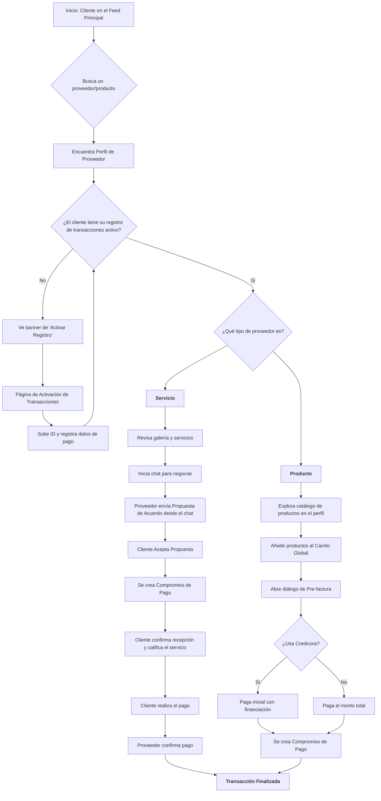
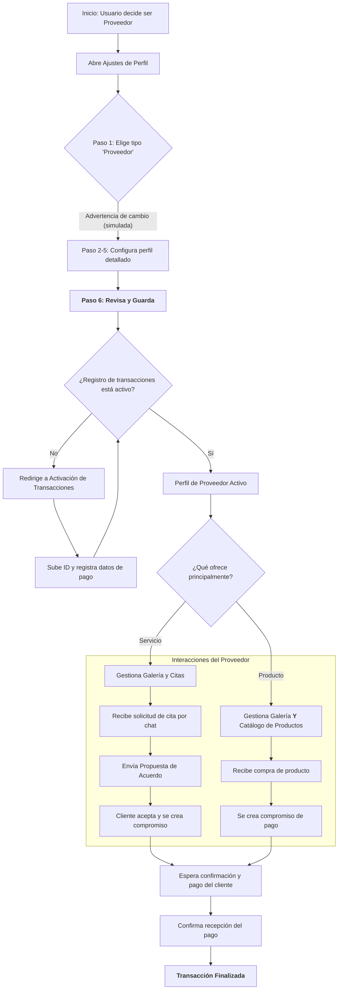
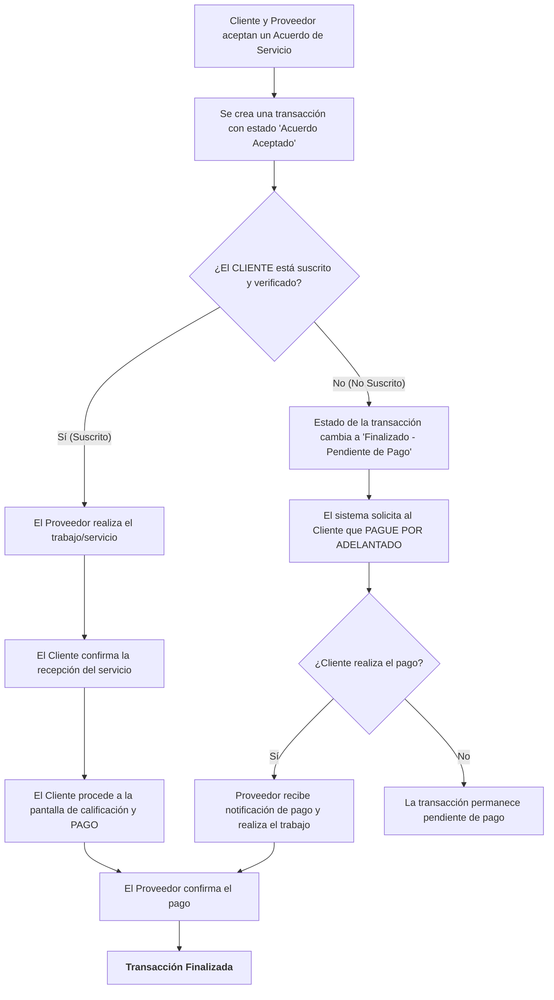

# Flujogramas de Procesos de Corabo

Este documento contiene los flujogramas que describen los principales procesos y la lógica de negocio de la aplicación Corabo.

---

## 1. Flujo del Cliente (Comprador)

Describe el viaje de un usuario que actúa como cliente.



---

## 2. Flujo del Proveedor

Detalla el viaje de un usuario que se configura y actúa como proveedor.



---

## 3. Flujo de Pago: Suscrito vs. No Suscrito

Detalla la diferencia clave en el flujo de pago según el estado de suscripción del cliente.



---

## 4. Flujo de Calificación y Finalización

Detalla el proceso para calificar un servicio, vinculándolo al pago.

```mermaid
graph TD
    A[Inicio: Proveedor finaliza un trabajo] --> B[Proveedor hace clic en 'Marcar como Finalizado'];
    B --> C[Estado de la transacción cambia a: <br><b>'Pendiente de Confirmación del Cliente'</b>];
    C --> D{Cliente recibe notificación y va a la transacción};

    E[Inicio Alternativo: Cliente va a pagar un servicio] --> F{¿El servicio ya fue confirmado por el cliente?};
    F -- No --> G[Sistema solicita: 'Primero, confirma que recibiste el servicio'];
    F -- Sí --> H[Cliente procede directamente al pago];

    D & G --> I[Cliente hace clic en 'Confirmar Recepción y Calificar'];
    
    I --> J[<b>PANTALLA DE CALIFICACIÓN OBLIGATORIA</b>];
    subgraph "Calificación del Servicio"
        J1[Cliente selecciona estrellas (1-5)]
        J2[Cliente escribe un comentario (opcional)]
        J1 & J2 --> J3[Cliente hace clic en 'Continuar a Pagar']
    end
    
    J --> K[El sistema guarda la calificación y el comentario en la transacción];
    K --> L[<b>PANTALLA DE REGISTRO DE PAGO</b>];
    L --> M[Cliente sube el comprobante y el número de referencia];
    M --> N[Estado de la transacción cambia a: <br><b>'Pago Enviado - Esperando Confirmación'</b>];
    
    N --> O[Proveedor recibe notificación y verifica el pago];
    O --> P{¿Pago Correcto?};
    P -- Sí --> Q[Proveedor confirma la recepción del pago];
    P -- No --> R[Proveedor puede iniciar una disputa];
    
    Q --> S[Estado de la transacción cambia a: <br><b>'Pagado' / 'Resuelto'</b>];
    S --> T[<b>ACTUALIZACIÓN DE REPUTACIÓN</b>];
    subgraph "Lógica del Sistema"
        T1[El sistema recalcula el promedio de reputación del proveedor] --> T2[La nueva reputación se muestra en el perfil del proveedor];
    end

    T --> U[<B>Flujo de Calificación Completo</B>];
```

---

## 5. Flujos de Delivery y Credicora

### 5.1. Flujo del Proveedor de Delivery

```mermaid
graph TD
    A[Proveedor de Delivery (Repartidor) está activo y disponible en la app] --> B{Recibe nueva solicitud de servicio de entrega};
    
    B --> C[Abre la solicitud para ver los detalles];
    subgraph "Detalles de la Solicitud"
        direction LR
        C1[<b>Vendedor:</b> Nombre y dirección de retiro]
        C2[<b>Cliente:</b> Dirección de entrega]
        C3[<b>Pedido:</b> N.º de orden y descripción (ej: '1 laptop', 'comida')]
        C4[<b>Mapa:</b> Visualización de la ruta de retiro y entrega]
        C5[<b>Tarifa Ofrecida:</b> Monto a ganar por el envío]
    end
    C --> D{¿Acepta el servicio de entrega?};

    D -- No --> E[Rechaza la solicitud o la deja expirar];
    E --> F[El sistema busca al siguiente repartidor más cercano];

    D -- Sí --> G[<b>Acepta el Compromiso de Entrega</b>];
    G --> H[Se crea una nueva transacción entre <br><b>Vendedor del Producto</b> y <b>Repartidor</b>];
    H --> I[Estado de la transacción: <br><b>'Acuerdo Aceptado - Pendiente de Ejecución'</b>];

    I --> J[Repartidor se dirige al punto de retiro (tienda del vendedor)];
    J --> K[Confirma en la app que ha retirado el paquete];
    K --> L[Estado cambia a: <b>'Servicio en Curso'</b>];
    
    L --> M[Repartidor se dirige al punto de entrega (cliente)];
    M --> N[Cliente confirma la recepción (ej: con un código)];
    N --> O[Repartidor marca la entrega como finalizada en la app];
    
    O --> P[Estado cambia a: <br><b>'Finalizado - Pendiente de Pago'</b>];
    P --> Q[El sistema notifica al Vendedor del Producto para que libere el pago];

    Q --> R{Vendedor del Producto transfiere el pago al Repartidor};
    R --> S[Repartidor confirma la recepción del pago];
    S --> T[Estado de la transacción cambia a: <br><b>'Pagado' / 'Resuelto'</b>];
    T --> U[<B>Flujo de Delivery Completo</B>];
```

### 5.2. Flujo de Compra con Delivery y Credicora

```mermaid
graph TD
    A[Cliente en diálogo de Pre-factura] --> B[Activa 'Incluir Delivery' y 'Pagar con Credicora'];

    B --> C[<b>Cálculo de Pago Complejo</b>];
    subgraph "El Sistema Calcula el Costo Total"
       D1[Total Productos] --> D2[Se calcula el Monto Financiado <br> sobre los productos según el nivel Credicora];
       D2 --> D3[Pago Inicial Productos = Total Productos - Monto Financiado];
       D3 --> D4[<b>Total a Pagar Hoy</b> = Pago Inicial Productos + 100% del Costo de Envío];
    end

    C --> E[Cliente ve el desglose: Total, Pago Inicial Hoy y Cuotas Futuras];
    E --> F[Cliente hace clic en 'Pagar Ahora'];

    F --> G[Se crea <b>Transacción Principal ÚNICA</b> por el valor del <b>Pago Inicial</b>];
     subgraph "Detalles de la Transacción Principal"
        direction LR
        G1[<b>Cliente:</b> Comprador]
        G2[<b>Proveedor:</b> Vendedor del Producto]
        G3[<b>Monto:</b> Valor del Total a Pagar Hoy]
        G4[<b>Estado:</b> 'Finalizado - Pendiente de Pago']
    end

    G --> H{Cliente paga el monto inicial y el Vendedor confirma};
    H -- Proceso de Pago y Verificación --> I[Estado de la Transacción Principal cambia a <b>'Pagado'</b>];

    I --> J[<b>AUTOMATIZACIÓN DEL SISTEMA POST-CONFIRMACIÓN</b>];
    
    subgraph "Flujo de Delivery (se inicia en paralelo)"
        J --> K[Sistema busca un repartidor y le envía la solicitud];
        K --> L[Repartidor acepta y se crea una <b>transacción secundaria</b> <br>(Vendedor -> Repartidor) por el costo del envío];
        L --> M[Repartidor recoge y entrega el producto];
    end

    subgraph "Flujo de Financiación (se inicia en paralelo)"
        J --> N[Sistema crea <b>N transacciones de cuotas futuras</b> <br>(Cliente -> Vendedor)];
        N --> O[Sistema crea <b>transacción de comisión</b> <br>(Vendedor -> Corabo)];
    end

    M --> P[El cliente recibe su producto];
    P --> Q[El cliente califica al Vendedor y al Repartidor];
    Q --> R[<B>Flujo de Compra, Delivery y Financiación Completo</B>];
```
