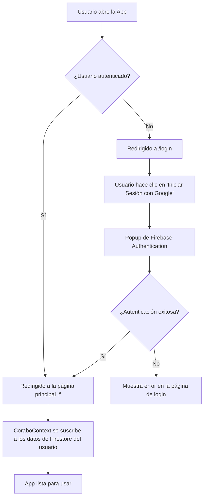
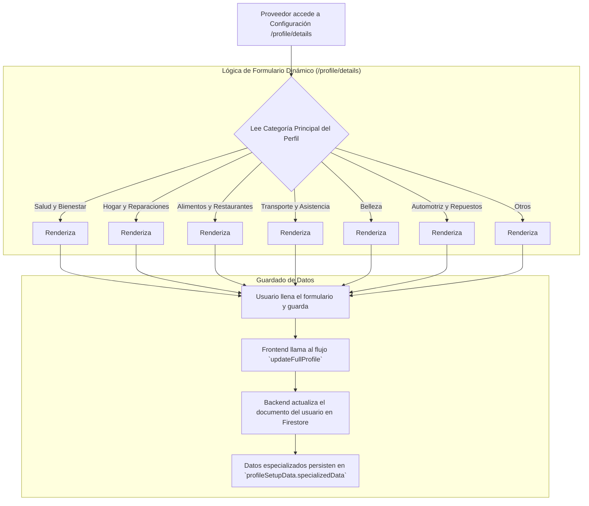

# Flujogramas de Procesos de Corabo

Este documento contiene los flujogramas que describen los principales procesos y la lógica de negocio de la aplicación Corabo, ahora con una arquitectura Cliente-Servidor utilizando Firebase y Genkit.

---

## 1. Flujo General de Autenticación y Acceso

Describe el viaje inicial de un usuario para acceder a la aplicación.



---

## 2. Flujo de Configuración de Perfil y Especialización

Describe cómo un proveedor configura su perfil y cómo se muestran detalles específicos según su categoría.




---

## 3. Flujo del Cliente (Compra de Producto) con Backend y Carrito Multi-Proveedor

Describe el viaje de un cliente en la nueva arquitectura al comprar un producto.

```mermaid
graph TD
    A[Inicio: Cliente en Perfil de Proveedor] --> B[Añade productos al carrito];
    B --> C[Abre el Carrito (Popover)];
    C --> D[Renderiza `MultiProviderCart` agrupando por proveedor];
    D --> D1[Cliente hace clic en 'Ver Prefactura' para Proveedor A];
    D1 --> E[Se abre `CheckoutAlertDialogContent` con productos de Proveedor A];
    
    subgraph "Selección de Entrega"
      direction TB
      E --> F{Elige método de entrega};
      F -- "Mi dirección" --> G[Usa dirección guardada];
      F -- "Mi ubicación actual (GPS)" --> H[Usa GPS del teléfono];
      F -- "Enviar a otra dirección" --> I[Pide datos de destinatario];
      I --> J[Redirige a /map];
      J --> K[Usuario selecciona ubicación y confirma];
      K --> E[Vuelve al diálogo de pre-factura con dirección y datos de 3ro actualizados];
    end
    
    subgraph "Confirmación y Pago"
      G --> L[Se actualiza el costo de envío];
      H --> L;
      K --> L;
      L --> M{¿Usa Credicora?};
      M -- Sí --> N[Calcula pago inicial y cuotas según nivel de Credicora];
      M -- No --> O[Muestra total a pagar];
      N --> P[Cliente hace clic en 'Pagar Ahora'];
      O --> P;
    end

    subgraph "Lógica de Backend (Genkit)"
      direction LR
      P --> Q_FE[Frontend llama al flujo `checkout` para Proveedor A];
      Q_FE --> R_BE[Genkit valida y crea la transacción final];
      R_BE --> S_BE{¿Se requiere delivery?};
      S_BE -- Sí --> T_BE[Backend llama al `findDeliveryProviderFlow` para buscar repartidor];
      S_BE -- No --> U_BE[Transacción queda en estado 'Listo para Retirar'];
    end
    
    subgraph "Lógica de Falla de Delivery"
        T_BE -- Falla --> W[Backend actualiza tx a 'Error de Delivery'];
        W --> X[Backend envía notificación a Proveedor A];
        X --> Y[Proveedor A ve opciones: Reintentar, Asignar propio, Convertir a Retiro];
    end
    
    T_BE -- Éxito --> V_FINAL[<B>Transacción Formalizada</B>];
    U_BE --> V_FINAL;

```

---

## 4. Flujo de Afiliación (Empresa - Profesional)

Describe cómo un profesional se afilia a una empresa.

```mermaid
graph TD
    A[Profesional visita perfil de Empresa] --> B[Hace clic en 'Solicitar Afiliación'];
    B --> C_FE[Frontend llama a `requestAffiliation`];
    C_FE --> D_BE[Genkit Flow crea documento de afiliación con estado 'pending'];
    D_BE --> E_NOTIFY[Flow envía notificación a la Empresa];

    subgraph Panel de Admin de la Empresa
        F[Empresa accede a /admin] --> G[Ve la solicitud en la pestaña 'Afiliaciones'];
        G --> H{¿Aprobar?};
        H -- Sí --> I_APPROVE[Llama a `approveAffiliation`];
        H -- No --> J_REJECT[Llama a `rejectAffiliation`];
    end
    
    subgraph Lógica de Backend (Aprobación)
      I_APPROVE --> K_BE[Flow actualiza estado a 'approved'];
      K_BE --> L_BE[Flow actualiza el perfil del Profesional con datos de la Empresa];
    end
    
    L_BE --> M[Profesional ahora muestra "Verificado por [Empresa]"];
    
```

---

## 5. Flujo de Campaña Publicitaria (con Backend)

Detalla el nuevo flujo de creación de campañas, ahora gestionado por Genkit.

```mermaid
graph TD
    A[Proveedor en su perfil hace clic en 'Gestionar Campañas'] --> B[Se abre el `CampaignDialog`];
    B --> C[Configura campaña (presupuesto, duración, etc.)];
    C --> D[Hace clic en 'Confirmar y Proceder al Pago'];
    
    subgraph "Lógica de Frontend/Backend"
      direction LR
      D --> E_FE[Frontend llama al flujo `createCampaignFlow` de Genkit];
      E_FE --> F_BE[**Genkit (Backend)** recibe los datos];
      F_BE --> G_BE[Calcula costos, aplica descuentos];
      G_BE --> H_BE[Crea el documento de la Campaña en Firestore con estado 'pending_payment'];
      H_BE --> I_BE[Crea una **Transacción de Sistema** en Firestore para el pago de la campaña];
    end

    I_BE --> J[Usuario es redirigido a la pantalla de pago de la transacción];
    J --> K[Usuario paga la transacción];
    
    subgraph "Lógica de Notificación del Backend"
      direction LR
      K --> L_VERIFY[Admin verifica el pago en el panel];
      L_VERIFY --> M_UPDATE[Sistema actualiza campaña a 'active'];
      M_UPDATE --> N_NOTIFY[Sistema llama al flujo `sendNewCampaignNotifications`];
      N_NOTIFY --> O_END[Usuarios relevantes reciben la notificación];
    end
    
    O_END --> P_FINAL[<B>Campaña Publicitaria Activa y Notificada</B>];

```