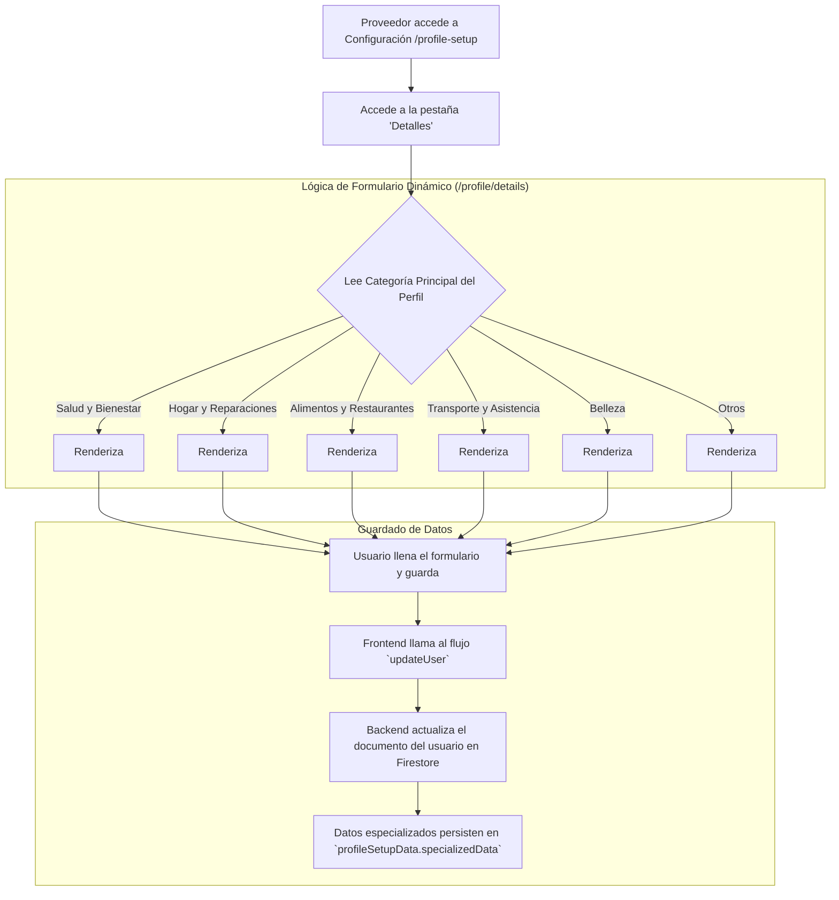

# Flujogramas de Procesos de Corabo

Este documento contiene los flujogramas que describen los principales procesos y la lógica de negocio de la aplicación Corabo, ahora con una arquitectura Cliente-Servidor utilizando Firebase y Genkit.

---

## 1. Flujo General de Autenticación y Acceso

Describe el viaje inicial de un usuario para acceder a la aplicación.


---

## 2. Flujo de Configuración de Perfil y Especialización

Describe cómo un proveedor configura su perfil y cómo se muestran detalles específicos según su categoría.




---

## 3. Flujo del Cliente (Comprador) con Backend

Describe el viaje de un cliente en la nueva arquitectura.

```mermaid
graph TD
    A[Inicio: Cliente en el Feed Principal] --> B[Encuentra Proveedor y hace clic en Mensaje Directo];
    B --> C[Se abre la pantalla de Chat /messages/[id]];
    C --> D[Cliente y Proveedor negocian];
    D --> E[**Proveedor** envía una 'Propuesta de Acuerdo' desde el chat];
    
    subgraph "Lógica de Backend (Genkit)"
        direction LR
        E --> F_FE[El Frontend llama al flujo `sendMessageFlow` en Genkit];
        F_FE --> G_BE[Genkit guarda la propuesta en el mensaje dentro de Firestore];
    end

    G_BE --> H_CLIENT[El cliente ve la cápsula de propuesta en el chat];
    H_CLIENT --> I_ACCEPT[Cliente hace clic en 'Revisar y Aceptar'];
    
    subgraph "Lógica de Backend (Genkit)"
        direction LR
        I_ACCEPT --> J_FE[El Frontend llama al flujo `acceptProposalFlow` en Genkit];
        J_FE --> K_BE[Genkit valida la acción y crea una nueva **Transacción** en Firestore];
    end

    K_BE --> L_FINAL[Se crea el Compromiso de Pago];
    L_FINAL --> M_END[<B>Transacción Formalizada</B>];
```

---

## 4. Flujo de Panel de Control del Proveedor

Describe cómo un proveedor interactúa con su nuevo dashboard financiero.


---

## 5. Flujo de Campaña Publicitaria (con Backend)

Detalla el nuevo flujo de creación de campañas, ahora gestionado por Genkit.

```mermaid
graph TD
    A[Proveedor en su perfil hace clic en 'Gestionar Campañas'] --> B[Se abre el `CampaignDialog`];
    B --> C[Configura campaña (presupuesto, duración, etc.)];
    C --> D[Hace clic en 'Confirmar y Proceder al Pago'];
    
    subgraph "Lógica de Frontend/Backend"
        direction LR
        D --> E_FE[Frontend llama al flujo `createCampaignFlow` de Genkit];
        E_FE --> F_BE[**Genkit (Backend)** recibe los datos];
        F_BE --> G_BE[Calcula costos, aplica descuentos];
        G_BE --> H_BE[Crea el documento de la Campaña en Firestore con estado 'pending_payment'];
        H_BE --> I_BE[Crea una **Transacción de Sistema** en Firestore para el pago de la campaña];
    end

    I_BE --> J[Usuario es redirigido a la pantalla de pago de la transacción];
    J --> K[Usuario paga la transacción];
    
    subgraph "Lógica de Notificación del Backend"
        direction LR
        K --> L_VERIFY[Admin verifica el pago en el panel];
        L_VERIFY --> M_UPDATE[Sistema actualiza campaña a 'active'];
        M_UPDATE --> N_NOTIFY[Sistema llama al flujo `sendNewCampaignNotifications`];
        N_NOTIFY --> O_END[Usuarios relevantes reciben la notificación];
    end
    
    O_END --> P_FINAL[<B>Campaña Publicitaria Activa y Notificada</B>];

```