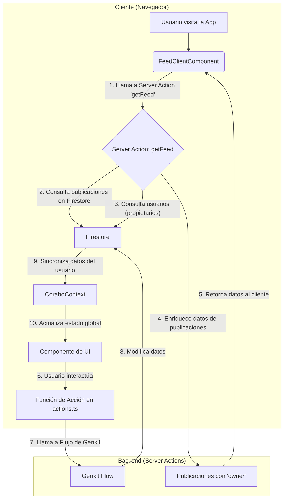

# Arquitectura y Flujo de Datos de Corabo (Versión Estable)

Este documento describe la arquitectura estable y desacoplada de la aplicación Corabo, diseñada para ser mantenible, escalable y eficiente bajo los principios del App Router de Next.js.

---

## 1. Principio Fundamental: Lógica de Servidor Centralizada y Flujo de Datos Unidireccional

La aplicación se rige por un principio estricto de separación de responsabilidades para garantizar la estabilidad y prevenir errores de hidratación:

-   **Renderizado del Lado del Servidor (SSR) con Verificación de Sesión:** El `RootLayout` (`src/app/layout.tsx`) actúa como un Server Component. Utiliza la SDK de Firebase Admin para verificar la sesión del usuario en el servidor antes de renderizar la página. El estado inicial del usuario se pasa al cliente para garantizar una hidratación consistente.
-   **`AppLayout.tsx` (El Guardián del Cliente):** Este componente es el núcleo de la lógica de enrutamiento del lado del cliente. Basándose en el estado de autenticación (que ya viene pre-cargado desde el servidor), decide si mostrar un loader, forzar redirecciones a `/login` o a `/initial-setup`, o dar acceso a la aplicación.
-   **Componentes de UI (React):** Se encargan exclusivamente de renderizar la interfaz y capturar las interacciones del usuario. No contienen lógica de negocio directa.
-   **Capa de Acciones (`src/lib/actions.ts`):** Es el **único intermediario** entre la UI y el backend. Contiene funciones de servidor (`'use server'`) que son llamadas por los componentes. Su trabajo es orquestar las llamadas a los flujos de Genkit o interactuar directamente con la base de datos.
-   **Contexto de React (`src/contexts/CoraboContext.tsx`):** Su única responsabilidad es actuar como un **proveedor de estado en tiempo real** para el cliente. Se suscribe a las colecciones de Firestore y distribuye los datos actualizados a toda la aplicación una vez que el usuario está autenticado y cargado.

Esta arquitectura desacoplada resuelve los errores de hidratación y asegura que la lógica de negocio permanezca en el servidor, mientras que la UI reacciona a los cambios en los datos.

---

## 2. Diagrama de Flujo de Datos (Arquitectura Actual)

Este diagrama ilustra la nueva arquitectura de comunicación, que es unidireccional y predecible.

### Descripción del Flujo:

1.  **Petición de Datos:** El `FeedClientComponent` en el navegador del cliente solicita una página de publicaciones llamando a la Server Action `getFeed`.
2.  **Consulta de Publicaciones:** La Server Action ejecuta una consulta en Firestore para obtener un lote de publicaciones.
3.  **Consulta de Propietarios:** La acción identifica los `providerId` de ese lote y realiza una única consulta optimizada para obtener los perfiles de los propietarios.
4.  **Enriquecimiento de Datos:** El servidor combina los datos, incrustando la información del propietario dentro de cada objeto de publicación.
5.  **Respuesta al Cliente:** El servidor devuelve el lote de publicaciones enriquecidas al `FeedClientComponent`.
6.  **Interacción del Usuario:** El usuario hace clic en un botón en un componente de React.
7.  **Llamada a la Acción:** El componente llama a una función `async` importada desde `src/lib/actions.ts`.
8.  **Ejecución en el Servidor:** La acción ejecuta la lógica de negocio correspondiente llamando a un flujo de Genkit.
9.  **Sincronización Reactiva:** El listener de Firestore en `CoraboContext` detecta cambios en datos específicos del usuario (como su perfil o notificaciones) y actualiza el estado global.
10. **Re-renderizado:** React re-renderiza los componentes que dependen de ese estado, mostrando la información actualizada.

Esta arquitectura elimina las consultas ineficientes del lado del cliente y las condiciones de carrera, garantizando una aplicación estable y de alto rendimiento.
